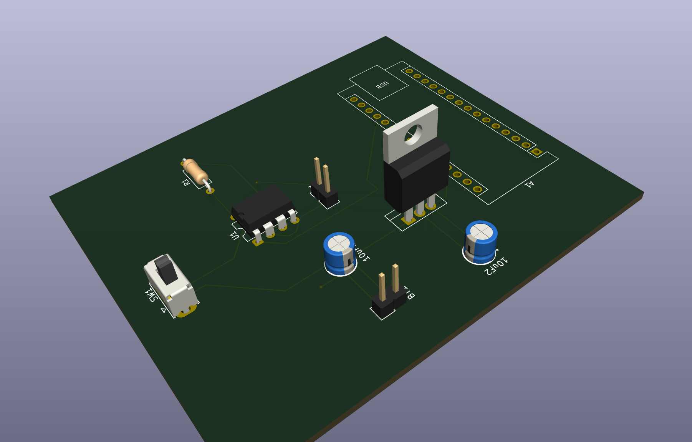
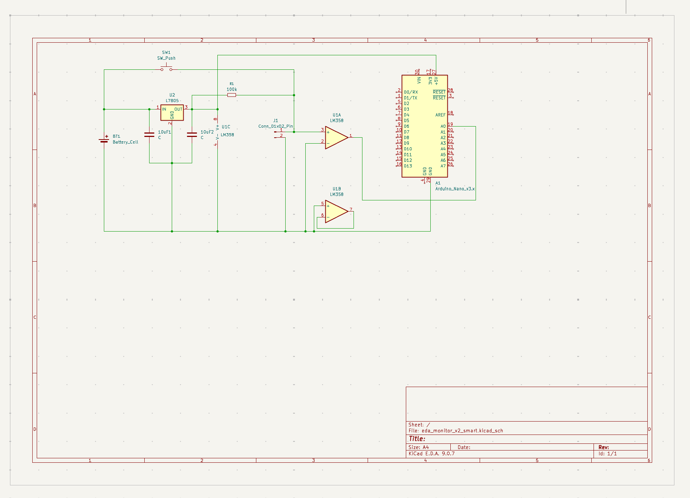
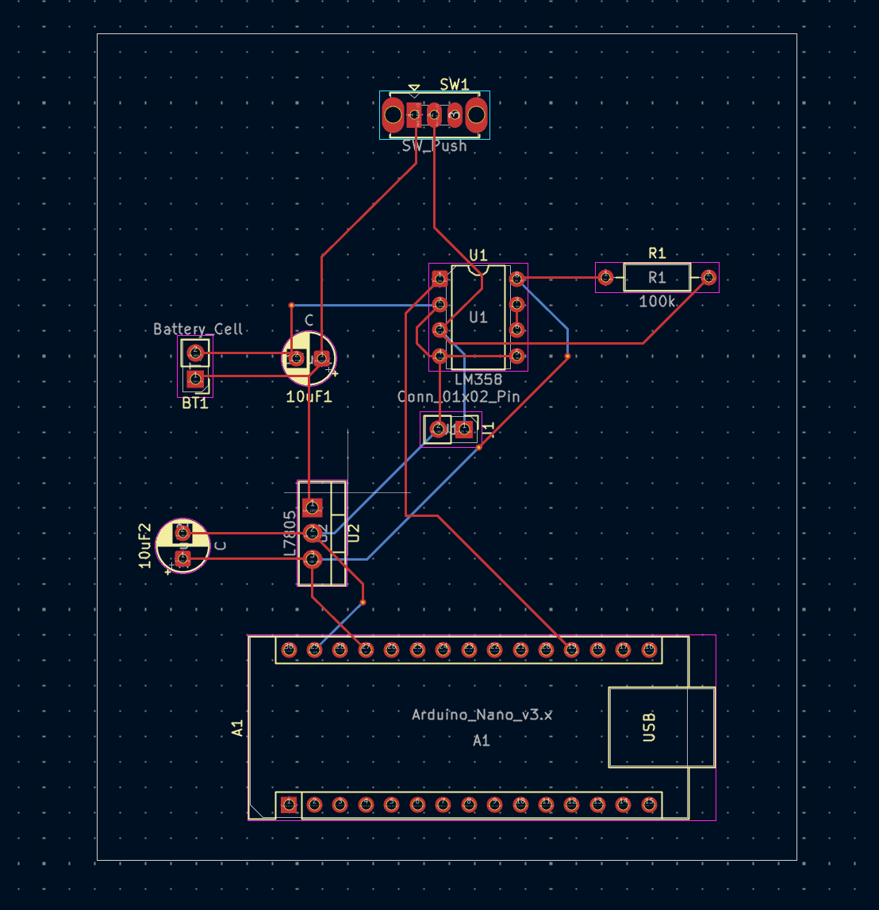

# ⚡ Smart EDA Stress Monitor v2.0

Bu proje, insan derisindeki elektriksel aktivite (Electrodermal Activity - EDA) değişimlerini ölçerek stres seviyesini analiz eden bir biyosensör prototipidir. v2.0 sürümünde, daha kararlı bir sinyal işleme katmanı ve kompakt bir PCB tasarımı hedeflenmiştir.

This project is a biosensor prototype that analyzes stress levels by measuring changes in Electrodermal Activity (EDA) on human skin. In version 2.0, a more stable signal processing layer and a compact PCB design were targeted.

---

## 📸 Proje Görselleri / Project Visuals

### 1. 3D Model Tasarımı / 3D Model Design

*KiCad 3D Viewer kullanılarak hazırlanan nihai ürün prototipi.*
*Final product prototype prepared using KiCad 3D Viewer.*

### 2. Devre Şeması / Schematic Diagram

*LM358 Op-Amp ve L7805 voltaj regülatör katmanlarını içeren elektriksel tasarım.*
*Electrical design including LM358 Op-Amp and L7805 voltage regulator stages.*

### 3. PCB Yolları ve Yerleşim / PCB Layout & Routing

*Çift katmanlı (Top & Bottom) kompakt PCB tasarımı. Üretim maliyetini düşürmek için optimize edilmiştir.*
*Dual-layer (Top & Bottom) compact PCB design. Optimized for lower production costs.*

---

## 🛠 Teknik Detaylar / Technical Details

### Donanım Bileşenleri / Hardware Components:
- **MCU:** Arduino Nano (ATmega328P)
- **Amplifier:** LM358 Op-Amp (For signal amplification and active filtering)
- **Power Management:** L7805 Voltage Regulator (Provides stable 5V output from 9V input)
- **Sensor Type:** Skin resistance measurement electrodes working with voltage divider principle.

### Tasarım Kararları / Design Decisions:
- **Compact Structure:** Components are placed close to each other, balancing soldering ease and portability.
- **Signal Quality:** Sensitive analog signal traces are kept as short as possible to minimize noise.

---

## 💻 Yazılım Mantığı / Software Logic

Arduino, LM358'den gelen yükseltilmiş analog veriyi **A0** pini üzerinden okur. / Arduino reads the amplified analog data from the LM358 via the **A0** pin.

```cpp
void setup() {
  Serial.begin(9600); // Seri haberleşme başlatıldı / Serial communication started
}

void loop() {
  int sensorValue = analogRead(A0); // A0 pininden veri oku / Read data from A0 pin
  Serial.println(sensorValue);      // Veriyi gönder / Send data for plotting
  delay(50);                        // Akıcı bir izleme için gecikme / Delay for smooth monitoring
}
